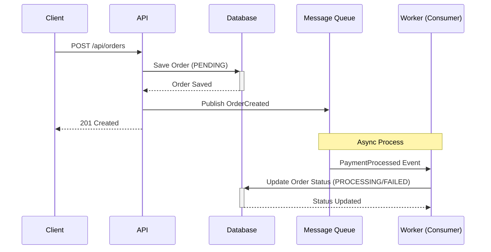
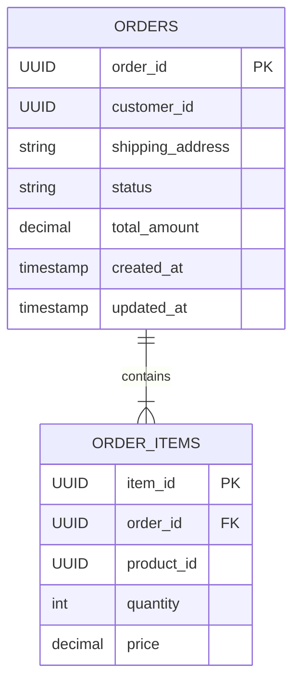

# Event-Driven Order Processing Service

A robust, event-driven backend service for processing orders, built with FastAPI, RabbitMQ, Redis, and PostgreSQL.

## Features

- **Order Creation**: REST API to create orders with validation.
- **Event-Driven Architecture**: Publishes `OrderCreated` events and consumes `PaymentProcessed` events using RabbitMQ.
- **Distributed Caching**: Uses Redis to cache order details for high performance.
- **Rate Limiting**: Limits API requests to 5 per minute per IP using Redis.
- **Data Persistence**: Stores orders and items in PostgreSQL with SQLAlchemy.
- **Containerization**: Fully Dockerized environment (App, DB, Redis, RabbitMQ).

## Technology Stack

- **Language**: Python 3.11+
- **Framework**: FastAPI
- **Database**: PostgreSQL / SQLAlchemy (Async) / Alembic
- **Message Broker**: RabbitMQ / aio-pika
- **Cache**: Redis / redis-py
- **Testing**: Pytest, Docker Compose

## Setup Instructions

Prerequisites: Docker and Docker Compose.

1.  Clone the repository.
2.  Run the application:
    ```bash
    docker-compose up -d --build
    ```
3.  The API will be available at `http://localhost:8000`.

## API Documentation

### Create Order

**POST** `/api/orders/`

Request Body:

```json
{
  "customer_id": "uuid-string",
  "items": [{ "product_id": "uuid-string", "quantity": 2 }],
  "shipping_address": "123 Main St"
}
```

Response (201 Created):

```json
{
  "order_id": "uuid",
  "status": "PENDING",
  "total_amount": 100.0,
  "created_at": "timestamp"
}
```

### Get Order

**GET** `/api/orders/{order_id}`

Response (200 OK):

```json
{
  "order_id": "uuid",
  "status": "PENDING",
  "items": [...],
  "total_amount": 100.0
}
```

## Testing

Integration tests are provided to verify the full flow (API -> DB -> MQ -> Consumer).

To run tests:

```bash
docker-compose exec app pytest
```

## Environment Variables

See `.env.example` for reference. Key variables:

- `DATABASE_URL`: Connection string for PostgreSQL.
- `RABBITMQ_URL`: Connection string for RabbitMQ.
- `REDIS_URL`: Connection string for Redis.
- `API_RATE_LIMIT_ENABLED`: Enable/Disable rate limiting.

## Architecture

1.  **API Layer**: FastAPI endpoints handle requests.
2.  **Service Layer**: Business logic for order creation.
3.  **Data Layer**: PostgreSQL stores `orders` and `order_items`.
4.  **Messaging**:
    - Produces `OrderCreated` to RabbitMQ.
    - Consumes `PaymentProcessed` from RabbitMQ.
5.  **Caching**: Redis caches `GET /orders/{id}` responses and tracks rate limits.

## Event Flow Diagram



## Database Schema



## Assumptions and Design Decisions

- **Rate Limiting Strategy**: Implemented using a Redis-based fixed window counter (5 requests/minute/IP) to prevent abuse while keeping implementation lightweight.
- **Caching Model**:
  - `GET /orders/{id}` responses are cached in Redis with a 60-second TTL.
  - **Consistency**: This system favors read performance over strict real-time consistency. Updates from the worker (e.g., status changes) do not immediately invalidate the cache, meaning clients might see "PENDING" for up to 60 seconds after a status change. This is a deliberate trade-off for this implementation.
- **Transactional Integrity**: Events are published to RabbitMQ only after the order is successfully committed to PostgreSQL, ensuring we don't publish events for failed orders.
- **UUID Handling**: UUIDs are used for all IDs to ensure uniqueness across distributed systems and avoid enumeration attacks.
